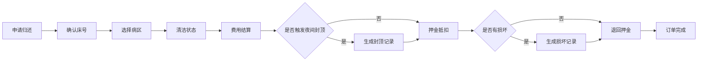

## 1. 产品概述
医院陪护床租借服务系统，为住院家属提供扫码租借陪护床的便捷服务，支持计时计费、夜间封顶、押金管理、损坏记录和订单全流程追踪。
- 解决医院陪护家属夜间休息难、人工租借流程繁琐的问题
- 提升医院管理效率，实现陪护床精细化运营

## 2. 核心功能

### 2.1 用户角色
| 角色 | 注册方式 | 核心权限 |
|------|---------|---------|
| 家属用户 | 扫码直接使用，手机号授权 | 扫码开锁、计时租借、归还确认、支付费用、查看订单 |
| 医护管理员 | 账号密码登录 | 订单管理、人工关闭、损坏登记、押金退款、数据统计 |

### 2.2 功能模块
1. **用户租借首页**：扫码入口、床位状态、租借说明、当前订单
2. **扫码开锁页**：床位信息确认、押金支付、开锁计时
3. **归还确认页**：床号确认、病区选择、清洁状态、费用结算
4. **订单管理页**：进行中订单、历史订单、订单详情
5. **异常记录中心**：夜间封顶记录、押金退回记录、床架损坏记录、人工关闭记录
6. **管理员后台**：订单列表、异常处理、数据概览

### 2.3 页面详情
| 页面名称 | 模块名称 | 功能描述 |
|---------|---------|---------|
| 用户租借首页 | 床位状态卡片 | 显示附近可用床位、床号、病区位置 |
| 用户租借首页 | 扫码入口 | 大按钮扫码，支持模拟扫码演示 |
| 用户租借首页 | 当前订单 | 显示正在进行的租借，实时计时 |
| 扫码开锁页 | 床位信息 | 显示床号、所属病区、日租金标准 |
| 扫码开锁页 | 押金支付 | 显示押金金额，支付后开锁 |
| 扫码开锁页 | 开锁动画 | 锁具打开动画，计时开始 |
| 归还确认页 | 床号确认 | 自动填充扫码床号，支持修改 |
| 归还确认页 | 病区选择 | 下拉选择归还病区 |
| 归还确认页 | 清洁状态 | 单选：已清洁/需清洁/污渍严重 |
| 归还确认页 | 费用结算 | 显示时长、基础费用、夜间封顶减免、实付金额 |
| 订单管理页 | 订单筛选 | 按状态筛选：进行中/已完成/已取消 |
| 订单管理页 | 订单列表 | 显示床号、租借时间、费用状态 |
| 异常记录中心 | 夜间封顶记录 | 触发封顶的订单、时段、减免金额 |
| 异常记录中心 | 押金退回记录 | 退款订单、退款金额、退款时间、操作人 |
| 异常记录中心 | 床架损坏记录 | 损坏床位、损坏描述、照片、处理状态 |
| 异常记录中心 | 人工关闭记录 | 关闭原因、操作人、关闭时间、费用处理方式 |
| 管理员后台 | 数据概览 | 今日订单数、在租数、收入、异常告警 |
| 管理员后台 | 人工关闭 | 搜索订单、填写关闭原因、选择费用减免方式 |

## 3. 核心流程

### 3.1 租借流程
家属扫描陪护床二维码 → 系统识别床位信息 → 确认押金金额并支付 → 电控锁打开 → 开始计时 → 家属使用陪护床

### 3.2 归还流程
家属点击归还 → 确认床号 → 选择病区 → 选择清洁状态 → 系统计算费用（含夜间封顶） → 押金抵扣 → 退回剩余押金 → 订单完成 → 生成异常记录（如有）

### 3.3 异常处理流程
管理员发现异常 → 搜索订单 → 选择异常类型（夜间封顶/损坏/人工关闭） → 填写详情 → 系统记录 → 费用调整 → 押金处理

## 4. 用户界面设计

### 4.1 设计风格
- **主色调**：医疗蓝 #2563EB（专业、信任）+ 生命绿 #10B981（安全、可用）
- **辅助色**：警示橙 #F59E0B（异常提醒）+ 危险红 #EF4444（损坏/告警）
- **按钮风格**：圆角8px，渐变填充，微立体阴影，悬停上浮动画
- **字体**：Noto Sans SC（清晰易读，医疗场景友好），标题加粗，正文Regular
- **布局风格**：卡片式布局，信息分区明确，白色背景+浅灰分隔
- **图标风格**：线性图标，2px描边，圆角处理

### 4.2 页面设计概述
| 页面名称 | 模块名称 | UI元素 |
|---------|---------|---------|
| 用户租借首页 | 床位状态卡片 | 卡片悬浮效果、状态标签颜色编码、床位图标 |
| 用户租借首页 | 扫码入口 | 大号圆形按钮、扫描线动画、脉冲光晕效果 |
| 用户租借首页 | 实时计时 | 大号数字时钟、绿色状态指示灯、计时动画 |
| 费用结算模块 | 费用明细 | 分项列表、夜间封顶高亮标签、金额汇总卡片 |
| 异常记录中心 | 记录列表 | 类型标签颜色区分、时间轴样式、操作人信息 |
| 管理员后台 | 数据概览 | 统计卡片、渐变背景、数据增长小图表 |

### 4.3 响应式
- 桌面端优先（管理员后台），移动端自适应（家属用户）
- 移动端：单列布局，大按钮，底部导航
- 桌面端：双栏布局，侧边菜单+内容区
- 触摸优化：按钮最小44px×44px，手势滑动支持

## 5. 业务规则
### 5.1 计费规则
- 基础费率：3元/小时
- 夜间封顶时段：22:00 - 次日06:00，封顶30元
- 全天封顶：60元/24小时
- 不足1小时按1小时计

### 5.2 押金规则
- 押金金额：200元/床
- 归还时无损坏全额退还
- 有损坏按损坏程度扣除

### 5.3 异常类型
- 夜间封顶：跨夜间时段自动触发，记录减免金额
- 押金退回：订单完成后自动或手动操作
- 床架损坏：归还时或巡检时登记，关联照片和描述
- 人工关闭：超时未还、设备故障、用户投诉等场景
