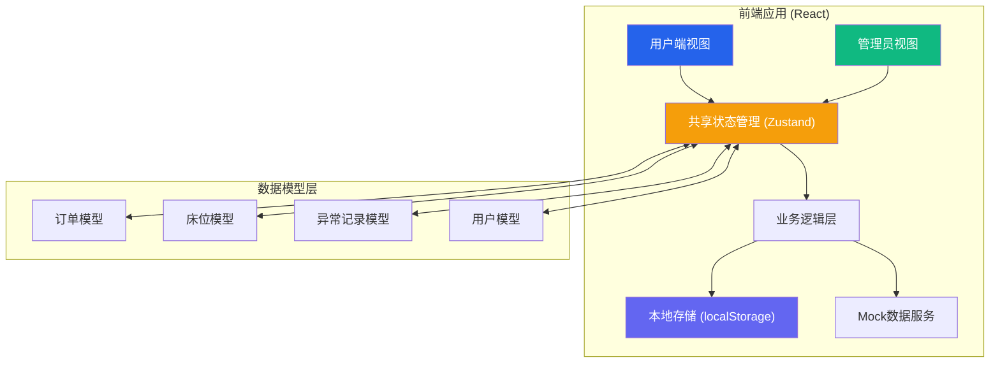
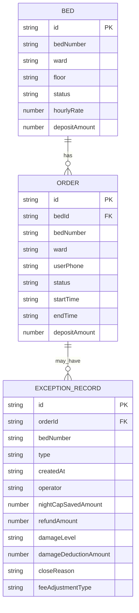

## 1. 架构设计



## 2. 技术描述
- **前端框架**: React@18 + TypeScript
- **构建工具**: Vite@5
- **样式方案**: TailwindCSS@3
- **状态管理**: Zustand@4（轻量、简洁的状态管理）
- **路由管理**: React Router DOM@6
- **图标库**: Lucide React
- **日期处理**: date-fns
- **数据持久化**: localStorage + 自定义Mock数据服务
- **UI组件**: 自定义组件（无第三方组件库依赖）

## 3. 路由定义
| 路由 | 用途 |
|------|------|
| / | 用户租借首页（扫码入口+床位状态） |
| /scan/:bedId | 扫码开锁确认页 |
| /return/:orderId | 归还确认页 |
| /orders | 订单列表页 |
| /orders/:orderId | 订单详情页 |
| /records | 异常记录中心 |
| /admin | 管理员登录页 |
| /admin/dashboard | 管理员数据概览 |
| /admin/orders | 管理员订单管理 |
| /admin/records | 管理员异常记录管理 |

## 4. 数据模型

### 4.1 核心数据类型定义

```typescript
// 床位状态
type BedStatus = 'available' | 'occupied' | 'maintenance' | 'damaged';

// 床位
interface Bed {
  id: string;
  bedNumber: string;
  ward: string;
  floor: string;
  status: BedStatus;
  hourlyRate: number;
  depositAmount: number;
  qrCode: string;
  lastMaintenanceDate?: string;
}

// 订单状态
type OrderStatus = 'pending' | 'active' | 'returning' | 'completed' | 'cancelled' | 'manual_closed';

// 清洁状态
type CleanStatus = 'clean' | 'need_clean' | 'heavily_soiled';

// 费用明细
interface FeeDetail {
  baseFee: number;
  nightCapDiscount: number;
  dailyCapDiscount: number;
  damageDeduction: number;
  cleaningFee: number;
  totalAmount: number;
}

// 订单
interface Order {
  id: string;
  bedId: string;
  bedNumber: string;
  ward: string;
  userPhone: string;
  status: OrderStatus;
  startTime: string;
  endTime?: string;
  durationMinutes?: number;
  depositAmount: number;
  feeDetail?: FeeDetail;
  actualPayment?: number;
  depositRefund?: number;
  cleanStatus?: CleanStatus;
  returnWard?: string;
  nightCapped?: boolean;
  dailyCapped?: boolean;
  createdAt: string;
  updatedAt: string;
}

// 异常记录类型
type RecordType = 'night_cap' | 'deposit_refund' | 'bed_damage' | 'manual_close';

// 损坏程度
type DamageLevel = 'minor' | 'moderate' | 'severe';

// 人工关闭原因
type CloseReason = 'timeout' | 'device_failure' | 'user_complaint' | 'staff_adjustment' | 'other';

// 异常记录
interface ExceptionRecord {
  id: string;
  orderId: string;
  bedNumber: string;
  type: RecordType;
  createdAt: string;
  operator: string;
  
  // 夜间封顶特有字段
  nightCapPeriod?: { start: string; end: string };
  originalNightFee?: number;
  nightCapFee?: number;
  nightCapSavedAmount?: number;
  
  // 押金退回特有字段
  refundAmount?: number;
  refundMethod?: 'original_payment' | 'cash' | 'transfer';
  refundStatus?: 'pending' | 'completed' | 'failed';
  
  // 床架损坏特有字段
  damageLevel?: DamageLevel;
  damageDescription?: string;
  damagePhotos?: string[];
  damageDeductionAmount?: number;
  damageStatus?: 'reported' | 'repairing' | 'resolved' | 'unrecoverable';
  
  // 人工关闭特有字段
  closeReason?: CloseReason;
  closeReasonDetail?: string;
  feeAdjustmentType?: 'full_waiver' | 'partial_waiver' | 'normal_charge';
  adjustedAmount?: number;
}

// 管理员
interface Admin {
  id: string;
  username: string;
  name: string;
  role: 'super_admin' | 'ward_admin' | 'operator';
}
```

### 4.2 ER图



### 4.3 初始Mock数据

```typescript
// 初始床位数据
const initialBeds: Bed[] = [
  { id: 'bed-001', bedNumber: 'A-101', ward: '内科病区', floor: '1F', status: 'available', hourlyRate: 3, depositAmount: 200, qrCode: 'QR-A101' },
  { id: 'bed-002', bedNumber: 'A-102', ward: '内科病区', floor: '1F', status: 'occupied', hourlyRate: 3, depositAmount: 200, qrCode: 'QR-A102' },
  { id: 'bed-003', bedNumber: 'A-103', ward: '内科病区', floor: '1F', status: 'available', hourlyRate: 3, depositAmount: 200, qrCode: 'QR-A103' },
  { id: 'bed-004', bedNumber: 'B-201', ward: '外科病区', floor: '2F', status: 'available', hourlyRate: 3, depositAmount: 200, qrCode: 'QR-B201' },
  { id: 'bed-005', bedNumber: 'B-202', ward: '外科病区', floor: '2F', status: 'maintenance', hourlyRate: 3, depositAmount: 200, qrCode: 'QR-B202' },
  { id: 'bed-006', bedNumber: 'B-203', ward: '外科病区', floor: '2F', status: 'available', hourlyRate: 3, depositAmount: 200, qrCode: 'QR-B203' },
];

// 初始订单数据
const initialOrders: Order[] = [
  {
    id: 'ord-2026-001',
    bedId: 'bed-002',
    bedNumber: 'A-102',
    ward: '内科病区',
    userPhone: '138****1234',
    status: 'active',
    startTime: new Date(Date.now() - 3 * 60 * 60 * 1000).toISOString(),
    depositAmount: 200,
    createdAt: new Date(Date.now() - 3 * 60 * 60 * 1000).toISOString(),
    updatedAt: new Date(Date.now() - 3 * 60 * 60 * 1000).toISOString(),
  },
];
```

## 5. 核心业务算法

### 5.1 费用计算算法
```
输入: startTime, endTime
输出: FeeDetail

1. 计算总时长 (分钟)
2. 按小时向上取整
3. 识别夜间时段 (22:00-06:00) 内的小时数
4. 识别是否跨多个自然日
5. 计算基础费用 = 总小时数 × 3元
6. 计算夜间封顶费 = 夜间小时数 × 3元, 若超过30元则封顶为30元
7. 计算每日封顶: 每24小时周期最高60元
8. 夜间封顶减免 = 夜间基础费 - 夜间封顶费
9. 全天封顶减免 = 日基础费 - 全天封顶费
10. 实付金额 = 基础费 - 各项减免 + 清洁费 + 损坏扣费
```

### 5.2 夜间封顶判定
- 扫描时段区间，判断是否覆盖 22:00-06:00
- 夜间累计费用超过30元部分予以减免
- 每跨一个夜间时段独立计算

## 6. 项目目录结构
```
src/
├── assets/              # 静态资源
├── components/          # 共享组件
│   ├── ui/             # 基础UI组件 (Button, Card, Modal等)
│   ├── layout/         # 布局组件
│   └── business/       # 业务组件 (BedCard, OrderCard, Timer等)
├── pages/              # 页面组件
│   ├── user/           # 用户端页面
│   └── admin/          # 管理员端页面
├── store/              # Zustand状态管理
│   ├── useOrderStore.ts
│   ├── useBedStore.ts
│   └── useRecordStore.ts
├── utils/              # 工具函数
│   ├── feeCalculator.ts
│   ├── dateUtils.ts
│   └── mockData.ts
├── types/              # TypeScript类型定义
├── App.tsx
├── main.tsx
└── index.css
```
